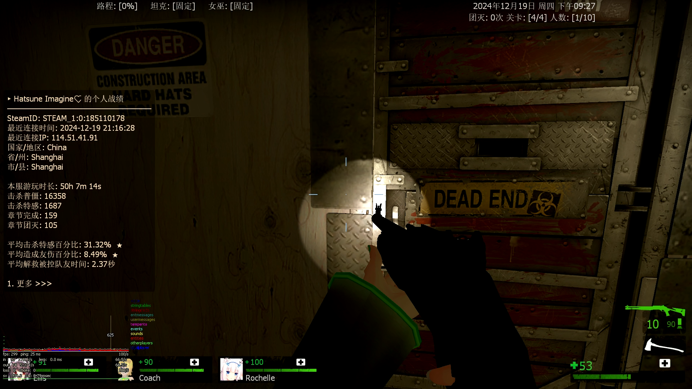
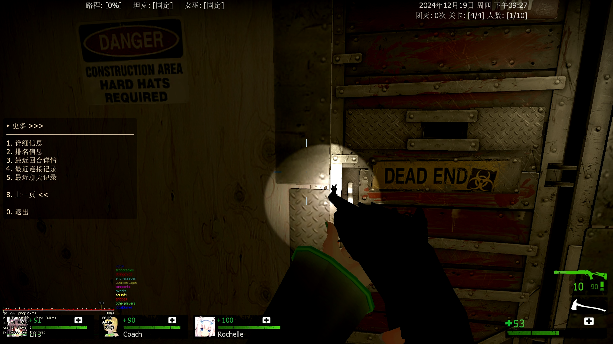
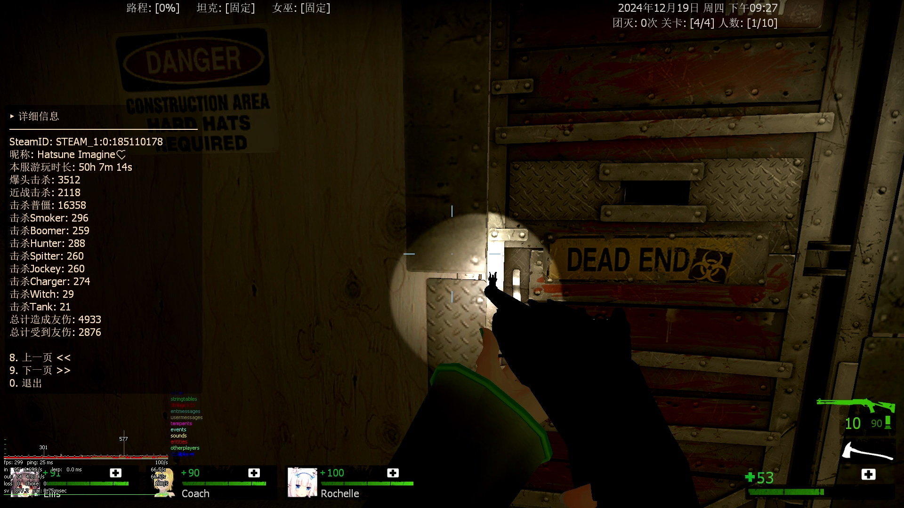
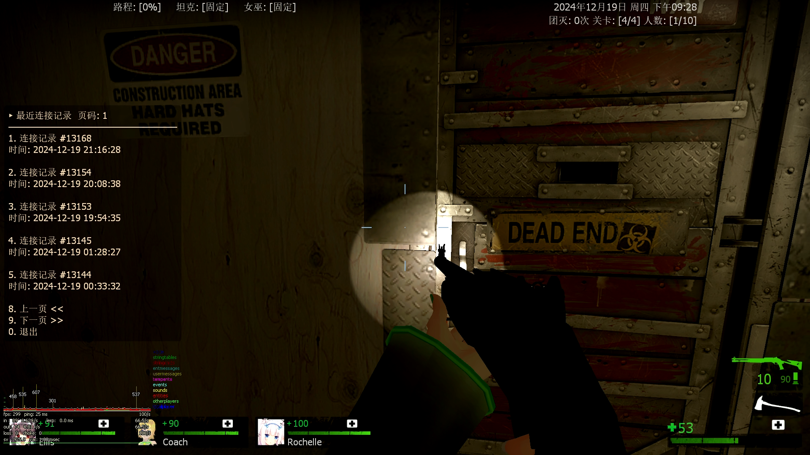

# 玩家信息面板显示


玩家信息面板显示插件，基于数据库读取并显示玩家信息。


**需要前置插件：**

**[l4d2_player_stats_db]**

https://github.com/Hatsune-Imagine/l4d2-plugins/tree/main/l4d2_player_stats_db


### 指令

显示玩家战绩面板：

`长按 TAB 键`

`/mystats`

`/my_stats`

`/show_stats`


显示当前游戏内玩家菜单：

`/stats`


### 配置项

```bash
// 长按 'TAB' 键可打开玩家个人战绩面板. (0=关闭, 1=开启)
// -
// Default: "1"
l4d2_player_stats_panel_enable_tab "1"

// 当玩家正在旁观其他玩家时，自动打开玩家战绩面板. (0=关闭, 1=开启)
// -
// Default: "1"
l4d2_player_stats_panel_enable_spec "1"

// 仅向管理员展示敏感信息. (0=否, 1=是)
// -
// Default: "0"
l4d2_player_stats_panel_sensitive_only_admin "0"
```


### 图例









