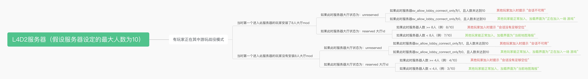

# 动态大厅

原作者来源：https://github.com/umlka/l4d2

---

##### v2.0.6 更新日志（2023-09-06）：

增加部分容错措施，以及在恢复大厅时向 Steam Master Server 发送心跳。

本次修改共计：

1. `OnConfigsExecuted()` 方法中的部分逻辑进行修改，新增 else 分支，如果此时人数 < 大厅容量，则将大厅id重新设置到服务器中。
2. 恢复大厅时，在服务器控制台执行 `heartbeat`。

---

##### v2.0.5 更新日志（2023-09-05）：

修复了一个会导致 “会话不可用” 的问题。因 “未实时获取当前大厅id” 或 “未及时清除之前保存的大厅id” 导致。

修复了代码中的一个逻辑错误。当服务器移除大厅时，会将此大厅id保存至此插件的一个变量中，且保存后不会再更新此变量的值，导致会出现这种情况：某玩家创建大厅进入了服务器，当满大厅人数时，此插件会将当前大厅id保存至插件的一个变量中，并移除当前服务器大厅。随后所有玩家退出了服务器，但服务器并未重启。随后又有其他玩家创建大厅并进入了此服务器，当满大厅人数后，此插件发现原先保存大厅id的变量中有值，则不获取当前大厅id并更新此变量的值了，随后移除当前服务器大厅。当有玩家退出时，如果此时服务器人数 < 大厅人数（对抗/清道夫：8，其他模式：4），则会将此变量保存的大厅id值重新设置到当前服务器中，而此变量此时保存的值却是上一批玩家的大厅id。因此，这时，想加入此服务器的玩家会发现无法加入，提示 “此会话已不可用” 。

本次修复了此情况导致的 “会话不可用” 问题。

本次修改共计：

1. 新增判断当前服务器是否为空的 `IsServerEmpty()` 方法。
2. 在玩家退出事件 `Event_PlayerDisconnect()` 方法中，判断此时服务器是否无人，如果无人则清除变量中保存的大厅id值。

---

##### v2.0.4 更新日志（2023-08-20）：

原作者插件会根据大厅人数情况动态设置 `sv_allow_lobby_connect_only` 的值，导致会有这种情况的发生：大厅被移除，但此时此cvar的值仍然是1（可能是原作者的逻辑漏洞，或服主在 `server.cfg` 中强制指定了此cvar的值为1），导致想加入的玩家加入时出现 “此会话已不可用” 的提示，从而无法加入游戏。

本次修改共计：

1. 部分代码写法优化。

2. 修复当 `server.cfg` 中强制指定了 `sv_allow_lobby_connect_only` 为1时，其他尝试连接的玩家可能收到 “会话不可用” 的情况。

3. 改用 left4dhooks.inc 中的方法来获取当前游戏模式。

4. 新增 `sm_reserve` 指令，可手动恢复当前服务器大厅。管理员可在服务器控制台执行此命令或在游戏聊天框中输入 `/reserve` 命令。

5. 移除了将 `sv_allow_lobby_connect_only` 设为1的逻辑，仅保留设为0的逻辑。

6. 将 `OnClientPutInServer()` 方法改为 `OnClientConnected()`。

---

### 附录

##### 情况汇总

